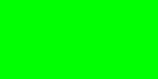
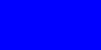
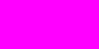

# SPEC3 Color Space

SPEC3 is a new color space that represents colors using a light spectrum compactly represented as 3 values (SX, SY, and SZ) that specify 3 spectral radiances at the wavelengths 440, 545, and 630nm.

It converts perceptual colors to the physically real spectra
that caused their perception. These physically real spectra
are useful for rendering realistic lighting
while still being able to convert between perceptual colors easily.

The three SPEC3 values (SX, SY, SZ) are combined with two bounding points to form a 5-point spectrum:

* *ɑ* at 348 nm (implicitly always = 0)
* **SX** at 438 nm
* **SY** at 542 nm
* **SZ** at 644 nm
* *ω* at 760 nm (implicitly always = 0)

Individual radiances can be computed at any wavelength 
(within the bounds of 348nm to 760nm)
using linear interpolation. This means that the color space can represent any color in the visible spectrum.
It can also represent UV and IR 0-bounded 412nm-wide spectra by tracking a wavelength offset.

The wavelengths were chosen as a balance between information loss
and avoiding negative spectra when converting from RGB and XYZ color spaces. (Negative values in SPEC3 are physically unreal and can be safely clipped away.)

Because the color space of SPEC3 directly measures energy,
addition of colors is simple vector addition. Because the energies
never need to be clipped, the color space is suitable for
high dynamic range rendering. Conversion back to XYZ will provide an
HDR color that can be toned mapped to a display.

The color space is designed to be linearly convertible from CIE XYZ and linear RGB color spaces with a minimal loss of information. Conversion is a simple linear transform so it's fast to convert to and from SPEC3.

## Example Color Values and Spectra

| Color | sRGB | SPEC3 | Spectrum |
| --- | --- | --- | --- |
|  | #ff0000 |  (0.000, 0.000, 1.190) |  |
|  | #00ff00 |  (0.000, 0.795, 0.136) |  |
|  | #0000ff |  (0.598, 0.002, 0.000) |  |
|  | #ff00ff |  (0.598, 0.000, 1.180) |  |
|  | #ffffff |  (0.595, 0.784, 1.316) |  |
|  | #808080 |  (0.127, 0.168, 0.282) |  |
|  | #000000 |  (0.000, 0.000, 0.000) |  |

## Conversion Functions

A nice feature of SPEC3 is that it's linearly convertible from CIE XYZ and linear RGB color spaces. Here are the conversion functions:

```python
def rgb_to_spec3(r, g, b):
    sx = 0.000141587 * r - 0.002455113 * g + 0.597643018 * b
    sy = -0.013257886 * r + 0.794843197 * g + 0.002330236 * b
    sz = 1.189601541 * r + 0.135728136 * g - 0.009427428 * b
    return sx, sy, sz
def spec3_to_rgb(sx, sy, sz):
    r = 0.013793349 * sx - 0.143229067 * sy + 0.839019716 * sz
    g = -0.004675269 * sx + 1.255705476 * sy + 0.013995166 * sz
    b = 1.673217416 * sx + 0.005192360 * sy - 0.000141279 * sz
    return r, g, b

def xyz_to_spec3(x, y, z):
    sx = 0.004709544 * x - 0.012239869 * y + 0.602859795 * z
    sy = -0.440814018 * x + 1.145623446 * y + 0.079106122 * z
    sz = 2.742976427 * x - 0.872786462 * y - 0.554287910 * z
    return sx, sy, sz
def spec3_to_xyz(sx, sy, sz):
    x = 0.339952916 * sx + 0.320124924 * sy + 0.415429920 * sz
    y = 0.016429141 * sx + 0.994843066 * sy + 0.159849510 * sz
    z = 1.656438351 * sx + 0.017697491 * sy + 0.000000085 * sz
    return x, y, z

def rgb_to_xyz(r, g, b):
    x = 0.490000010 * r + 0.310000002 * g + 0.200000003 * b
    y = 0.176970005 * r + 0.812399983 * g + 0.010630000 * b
    z = 0.000000000 * r + 0.010000000 * g + 0.990000010 * b
    return x, y, z
def xyz_to_rgb(x, y, z):
    r = 2.364613771 * x - 0.896540523 * y - 0.468073308 * z
    g = -0.515166223 * x + 1.426408052 * y + 0.088758111 * z
    b = 0.005203699 * x - 0.014408163 * y + 1.009204507 * z
    return r, g, b
```

```rust
fn rgb_to_spec3(rgb: vec3<f32>) -> vec3<f32> {
    const rgb_to_spec3: mat3x3<f32> = mat3x3(
        0.000141587, -0.013257886, 1.189601541, 
        -0.002455113, 0.794843197, 0.135728136, 
        0.597643018, 0.002330236, -0.009427428, 
    );
    return rgb_to_spec3 * rgb;
}
fn spec3_to_rgb(spec3: vec3<f32>) -> vec3<f32> {
    const spec3_to_rgb: mat3x3<f32> = mat3x3(
        0.013793349, -0.004675269, 1.673217416, 
        -0.143229067, 1.255705476, 0.005192360, 
        0.839019716, 0.013995166, -0.000141279, 
    );
    return spec3_to_rgb * spec3;
}

fn xyz_to_spec3(xyz: vec3<f32>) -> vec3<f32> {
    const xyz_to_spec3: mat3x3<f32> = mat3x3(
        0.004709544, -0.440814018, 2.742976427, 
        -0.012239869, 1.145623446, -0.872786462, 
        0.602859795, 0.079106122, -0.554287910, 
    );
    return xyz_to_spec3 * xyz;
}
fn spec3_to_xyz(spec3: vec3<f32>) -> vec3<f32> {
    const spec3_to_xyz: mat3x3<f32> = mat3x3(
        0.339952916, 0.016429141, 1.656438351, 
        0.320124924, 0.994843066, 0.017697491, 
        0.415429920, 0.159849510, 0.000000085, 
    );
    return spec3_to_xyz * spec3;
}

fn rgb_to_xyz(xyz: vec3<f32>) -> vec3<f32> {
    const rgb_to_xyz: mat3x3<f32> = mat3x3(
        0.490000010, 0.176970005, 0.000000000, 
        0.310000002, 0.812399983, 0.010000000, 
        0.200000003, 0.010630000, 0.990000010, 
    );
    return rgb_to_xyz * xyz;
}
fn xyz_to_rgb(xyz: vec3<f32>) -> vec3<f32> {
    const xyz_to_rgb: mat3x3<f32> = mat3x3(
        2.364613771, -0.515166223, 0.005203699, 
        -0.896540523, 1.426408052, -0.014408163, 
        -0.468073308, 0.088758111, 1.009204507, 
    );
    return xyz_to_rgb * xyz;
}
```


## Why Another Color Space?

Benefits:

- [x] Compact representation suitable for realtime GPU rendering (SX, SY, SZ, SW happily fit into 16 or 32-bit vectors)
- [x] High dynamic range since radiance values can be accumulated without clipping.

