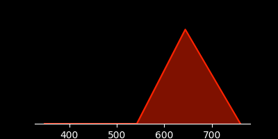
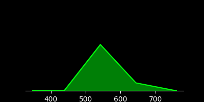
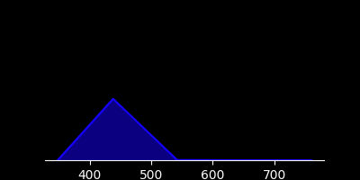
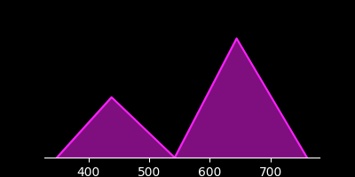
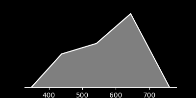
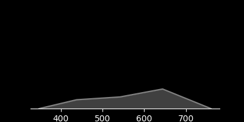
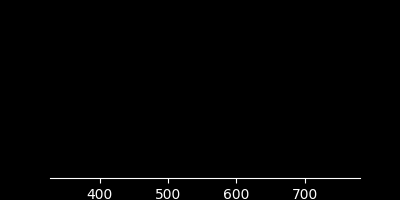

# SPEC3 Color Space

SPEC3 is a new color space that represents colors using a light spectrum compactly represented as 3 values (SX, SY, and SZ) that specifies 3 spectral radiances at the wavelengths 440, 545, and 630nm.

In a nutshell, it converts a perceptual color to the physically real spectrum
that caused that perception. This is useful for rendering realistic lighting
while still being able to convert between perceptual colors and physical light energies.

The three values are combined with two bounding points to form a 5-point spectrum:

* *ɑ* at 348 nm (implicitly always = 0)
* **SX** at 438 nm
* **SY** at 542 nm
* **SZ** at 644 nm
* *ω* at 760 nm (implicitly always = 0)

Individual radiances can be computed at any wavelength 
(within the bounds of 348nm to 760nm)
using linear interpolation. This means that the color space can represent any color in the visible spectrum
along with any UV and IR "colors" in a 0-bounded 412nm window by tracking a wavelength offset.

The wavelengths were chosen as a balance between information loss
and avoiding spectra with negative values. Negative values are
physically unreal and can be safely clipped away.

Because the color space of SPEC3 directly measures energy,
addition of colors is simple vector addition. Because the energies
never need to be clipped, the color space is suitable for
high dynamic range rendering. Conversion back to XYZ will provide an
HDR color that can be toned mapped to a display.

The color space is designed to be linearly convertible from CIE XYZ and linear RGB color spaces with a minimal loss of information. Conversion is a simple linear transform so it's fast to convert to and from SPEC3.

## Example Color Values and Spectra

| Color | sRGB | SPEC3 | Spectrum |
| --- | --- | --- | --- |
| <span style='background-color: #ff0000; width: 64px; height: 24px; display: inline-block'></span> | #ff0000 |  (0.000, 0.000, 1.190) |  |
| <span style='background-color: #00ff00; width: 64px; height: 24px; display: inline-block'></span> | #00ff00 |  (0.000, 0.795, 0.136) |  |
| <span style='background-color: #0000ff; width: 64px; height: 24px; display: inline-block'></span> | #0000ff |  (0.598, 0.002, 0.000) |  |
| <span style='background-color: #ff00ff; width: 64px; height: 24px; display: inline-block'></span> | #ff00ff |  (0.598, 0.000, 1.180) |  |
| <span style='background-color: #ffffff; width: 64px; height: 24px; display: inline-block'></span> | #ffffff |  (0.595, 0.784, 1.316) |  |
| <span style='background-color: #808080; width: 64px; height: 24px; display: inline-block'></span> | #808080 |  (0.127, 0.168, 0.282) |  |
| <span style='background-color: #000000; width: 64px; height: 24px; display: inline-block'></span> | #000000 |  (0.000, 0.000, 0.000) |  |

## Conversion Functions

A nice feature of SPEC3 is that it's linearly convertible from CIE XYZ and linear RGB color spaces. Here are the conversion functions:

```python
def xyz_to_spec3(x, y, z):
    sx = 0.004709544126 * x - 0.012239868753 * y + 0.602859795094 * z
    sy = -0.440814018250 * x + 1.145623445511 * y + 0.079106122255 * z
    sz = 2.742976427078 * x - 0.872786462307 * y - 0.554287910461 * z
    return sx, sy, sz
def spec3_to_xyz(sx, sy, sz):
    x = 0.339952915907 * sx + 0.320124924183 * sy + 0.415429919958 * sz
    y = 0.016429141164 * sx + 0.994843065739 * sy + 0.159849509597 * sz
    z = 1.656438350677 * sx + 0.017697490752 * sy + 0.000000085466 * sz
    return x, y, z

def rgb_to_spec3(r, g, b):
    sx = 0.000141587079 * r - 0.002455112990 * g + 0.597643017769 * b
    sy = -0.013257886283 * r + 0.794843196869 * g + 0.002330236137 * b
    sz = 1.189601540565 * r + 0.135728135705 * g - 0.009427428246 * b
    return sx, sy, sz
def spec3_to_rgb(sx, sy, sz):
    r = 0.013793349266 * sx - 0.143229067326 * sy + 0.839019715786 * sz
    g = -0.004675269127 * sx + 1.255705475807 * sy + 0.013995165937 * sz
    b = 1.673217415810 * sx + 0.005192359909 * sy - 0.000141279059 * sz
    return r, g, b
```

```rust
fn xyz_to_spec3(xyz: vec3<f32>) -> vec3<f32> {
    const xyz_to_spec3: mat3x3<f32> = mat3x3(
        0.004709544126, -0.012239868753, 0.602859795094, 
        -0.440814018250, 1.145623445511, 0.079106122255, 
        2.742976427078, -0.872786462307, -0.554287910461, 
    );
    return xyz_to_spec3 * xyz;
}
fn spec3_to_xyz(spec3: vec3<f32>) -> vec3<f32> {
    const spec3_to_xyz: mat3x3<f32> = mat3x3(
        0.339952915907, 0.320124924183, 0.415429919958, 
        0.016429141164, 0.994843065739, 0.159849509597, 
        1.656438350677, 0.017697490752, 0.000000085466, 
    );
    return spec3_to_xyz * spec3;
}

fn rgb_to_spec3(rgb: vec3<f32>) -> vec3<f32> {
    const rgb_to_spec3: mat3x3<f32> = mat3x3(
        0.000141587079, -0.002455112990, 0.597643017769, 
        -0.013257886283, 0.794843196869, 0.002330236137, 
        1.189601540565, 0.135728135705, -0.009427428246, 
    );
    return rgb_to_spec3 * rgb;
}
fn spec3_to_rgb(spec3: vec3<f32>) -> vec3<f32> {
    const spec3_to_rgb: mat3x3<f32> = mat3x3(
        0.013793349266, -0.143229067326, 0.839019715786, 
        -0.004675269127, 1.255705475807, 0.013995165937, 
        1.673217415810, 0.005192359909, -0.000141279059, 
    );
    return spec3_to_rgb * spec3;
}
```


## Why Another Color Space?

Benefits:

- [x] Compact representation suitable for realtime GPU rendering (SX, SY, SZ, SW happily fit into 16 or 32-bit vectors)
- [x] High dynamic range since radiance values can be accumulated without clipping.

